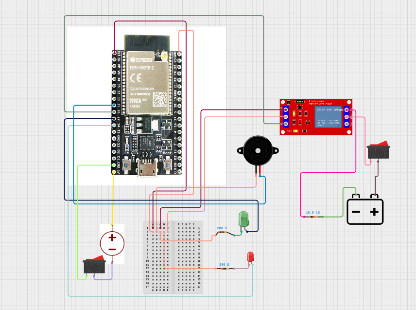

# 🚀 IgnisLink-32: Wireless Rocket Launch Controller

**IgnisLink-32** is a modern, safety-critical Ground Support Equipment (GSE) system for model rocketry. It replaces traditional analog launch cables with a secure, high-speed Wi-Fi link, allowing operators to launch rockets using a smartphone or laptop from a safe distance.

---

## ✨ Features

* **📡 Wireless Access Point:** Creates its own Wi-Fi network (`RocketCommand`). No router or internet required—works in the middle of a desert.
* **📱 Headless Interface:** Hosting a dedicated HTML5 Web App directly on the chip. Works on Android, iOS, Windows, and Linux without installing apps.
* **🛡️ Defense-in-Depth Safety:**
    * **Physical:** Master Arming Switch requirement.
    * **Software:** Mandatory 5-second audible countdown.
    * **Watchdog:** 3.0-second auto-cutoff to prevent battery shorts and relay fusion.
* **⚡ Galvanic Isolation:** Uses a Relay Module to physically isolate the 5V logic brain from the 12V high-current firing muscle.
* **🧪 Simulation Mode:** Safe testing protocols using LED indicators before live fire.

---

## 🛠️ Hardware Required

| Component | Quantity | Description |
| :--- | :---: | :--- |
| **ESP32 DevKit V1** | 1 | The Microcontroller Brain |
| **5V Relay Module** | 1 | 1-Channel, Active High/Low |
| **12V Battery** | 1 | Lead-Acid or LiPo (High Discharge) |
| **Master Toggle Switch** | 1 | Heavy Duty (20A rated) |
| **Piezo Buzzer** | 1 | Active type (5V) |
| **LEDs** | 2 | Red (Armed), Green (Safe) |
| **Resistors** | 2 | 220Ω (For LEDs) |
| **Wiring** | - | Jumper wires & 16AWG Power wire |

---

## 🔌 Pin Configuration

| Component | ESP32 Pin | Function |
| :--- | :---: | :--- |
| **Relay Signal** | GPIO 26 | Triggers the ignition |
| **Buzzer** | GPIO 25 | Audible Countdown |
| **Green LED** | GPIO 27 | System Idle / Safe |
| **Red LED** | GPIO 14 | System Armed / Firing |

---

## 🚀 Installation & Usage

### 1. Uploading the Code
1.  Install the [Arduino IDE](https://www.arduino.cc/en/software).
2.  Install the **ESP32 Board Manager** (`Tools` > `Board` > `Boards Manager`).
3.  Open `Rocket_Launch_Controller_Final.ino`.
4.  Select your board (e.g., **DOIT ESP32 DEVKIT V1**) and correct Port.
5.  Click **Upload**.

### 2. Operation
1.  **Power Up:** Connect the ESP32 to a USB power bank.
2.  **Connect:** On your phone, join the Wi-Fi Network:
    * **SSID:** `RocketCommand`
    * **Password:** `GoForLaunch`
3.  **Interface:** Open a web browser and go to `192.168.4.1`.
4.  **Arm:** Flip the Physical Master Switch to **ON**.
5.  **Launch:** Press the big red **LAUNCH** button on your screen.

---

## ⚠️ Safety Warnings

> **CRITICAL SAFETY INFORMATION**

* **ALWAYS** use the physical Master Arm switch. Software can fail; physics does not.
* **NEVER** connect the igniter clips to the rocket while the electronics are powered on.
* **ALWAYS** follow [NAR (National Association of Rocketry) Safety Codes](https://www.nar.org/safety-information-model-rocketry-safety-code/).
* **TEST** your system in "Simulation Mode" (using an LED instead of an igniter) before every field day.

---

## 🤝 Contributing

Contributions, issues, and feature requests are welcome!

1.  Fork the Project
2.  Create your Feature Branch (`git checkout -b feature/AmazingFeature`)
3.  Commit your Changes (`git commit -m 'Add some AmazingFeature'`)
4.  Push to the Branch (`git push origin feature/AmazingFeature`)
5.  Open a Pull Request

---

## 📄 License

Distributed under the MIT License. See `LICENSE` for more information.

---

  Built with ❤️ and ☕ for Space Enthusiasts.

